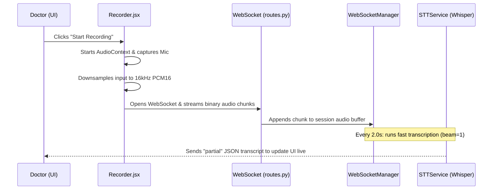
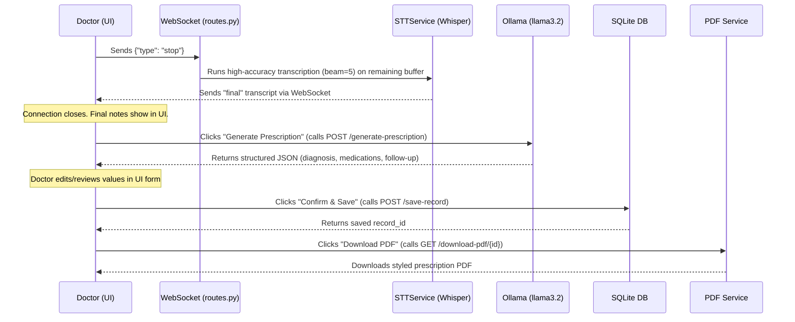

# HANDOFF.md

## Project Summary

**MediScribe Voice-to-Notes** is a real-time, privacy-first speech-to-text (ASR) and clinical note-taking assistant. It allows healthcare providers (e.g., doctors) to dictate clinical observations, see a live preview of the transcription, and finalize the text. Once finalized, a local LLM extracts structured clinical data (diagnosis, symptoms, follow-up, and medications). The structured record is editable in the UI, can be persisted to a local database, and can be downloaded as a professionally formatted PDF prescription.

---

## Stack

### Backend
- **Core Framework**: [FastAPI](https://fastapi.tiangolo.com/) (Python 3)
- **ASGI Server**: [Uvicorn](https://www.uvicorn.org/)
- **ASR Engine**: [Faster-Whisper](https://github.com/SYSTRAN/faster-whisper) (v1.0.3) - A fast implementation of OpenAI's Whisper model using CTranslate2.
- **LLM Provider**: [Ollama](https://ollama.com/) (using the `llama3.2` model locally for HIPAA-compliant structured extraction).
- **Database**: SQLite (built-in Python `sqlite3`, zero-configuration, stores to `records.db`).
- **PDF Generation**: [ReportLab](https://www.reportlab.com/) (generates styled PDFs on the fly in-memory).

### Frontend
- **Framework**: React (Create React App template)
- **Styling**: Vanilla CSS (modular, glassmorphic layout)
- **Communication**: WebSockets (native browser WebSockets API for real-time binary audio stream and JSON responses) and HTTP Fetch API.

---

## File Structure

```text
mediscribe-stt/
├── HANDOFF.md                   # This master handoff document
├── README.md                     # Standard project overview
├── backend/
│   ├── main.py                  # FastAPI application entrypoint and lifespan management
│   ├── routes.py                # HTTP and WebSocket endpoint controllers
│   ├── websocket_manager.py     # Connection manager & rolling audio/transcript buffers
│   ├── stt_service.py           # Faster-Whisper singleton model wrapper
│   ├── prescription_service.py  # Local Ollama client wrapper for JSON clinical extraction
│   ├── pdf_service.py           # ReportLab helper to generate styled prescription PDFs
│   ├── database.py              # SQLite helper functions (init, save, read records)
│   ├── requirements.txt         # Python dependencies
│   └── records.db               # SQLite database file (created on startup)
└── frontend-app/
    ├── package.json             # npm dependencies and start script
    ├── public/                  # Static assets
    └── src/
        ├── App.js               # Main React entrypoint, state management, socket wiring
        ├── App.css              # Main glassmorphic styles
        ├── index.js             # ReactDOM rendering target
        ├── index.css            # Core body styling
        ├── components/
        │   ├── Recorder.jsx     # Captures audio, downsamples to 16kHz, converts to PCM16
        │   └── LiveTranscript.jsx # Handles live/final transcript display, AI action flow, editor, & save/PDF trigger
        └── services/
            └── websocketService.js # Helper class wrapping the browser WebSocket connection
```

---

## App Flow

### 1. Audio Capture & Streaming


### 2. Finalization & Saving


---

## Current Tasks

- [ ] **Migrate to AudioWorklet**: Refactor [Recorder.jsx](file:///Users/jaysingh/Desktop/mediscribe-stt/frontend-app/src/components/Recorder.jsx) to use `AudioWorklet` instead of the deprecated `ScriptProcessorNode` for smoother audio capture threads.
- [ ] **Configurable Env Variables**: Move hardcoded values in [prescription_service.py](file:///Users/jaysingh/Desktop/mediscribe-stt/backend/prescription_service.py) (Ollama URL `http://localhost:11434` and model `llama3.2`) to environment variables or config files.
- [ ] **Dashboard/History View**: Add a frontend history dashboard showing all past records from the SQLite database. Currently, [database.py](file:///Users/jaysingh/Desktop/mediscribe-stt/backend/database.py) implements `get_all_records()`, but there is no frontend route/view to display them.
- [ ] **Clean Up Dead Code**: Remove or implement `save_to_records` in [prescription_service.py](file:///Users/jaysingh/Desktop/mediscribe-stt/backend/prescription_service.py) which is currently a dummy placeholder function.
- [ ] **Ollama Fallback / Check**: Add a backend check or startup check for Ollama status to output a warning in CLI if the server is unreachable or if `llama3.2` is not pulled.

---

## Bug Log

- **Missing Reconnect Handler**: If the WebSocket connection disconnects due to brief network hiccups, the recording stops abruptly and fails silently in the background until the doctor attempts to stop or restart.
- **Audio Sample Quality**: The downsampler uses simple linear interpolation. Depending on the mic, this can occasionally degrade audio quality on some devices, leading to lower Whisper transcription accuracy compared to standard cubic/sinc resampling.
- **Ollama Timeout**: During cold start (first run), Ollama can take longer than 60 seconds to load the model into memory. This causes a `ConnectError` or timeout in [prescription_service.py](file:///Users/jaysingh/Desktop/mediscribe-stt/backend/prescription_service.py).

---

## Decisions

- **Local Inference for HIPAA**: Clinical notes contain Protected Health Information (PHI). Running ASR locally via `Faster-Whisper` and LLM extraction via `Ollama` ensures no voice or text data is sent to external APIs (like OpenAI or Anthropic), aligning with medical privacy regulations.
- **FastAPI Startup Lifespan Model Cache**: Whisper models are massive and slow to load. We load the model once into memory as a Singleton during FastAPI's lifespan initialization, serving all future client connections instantly without cold-start latency.
- **SQLite Database**: Storing clinical records in a single local file (`records.db`) is ideal for lightweight medical offices, local desktop deployments, and testing environments.
- **Chunked Re-transcription**: Whisper is a block-level transcriber. To simulate streaming, the frontend continuously streams raw audio, and the backend transcribes the cumulative buffer every 2 seconds for a responsive "live typing" effect, resetting the buffer on silence/period limits to optimize performance.

---

## Setup

### 1. Prerequisites
- **Python**: 3.8 to 3.11 recommended (Faster-Whisper compatibility).
- **Node.js**: 16+ for the frontend app.
- **Ollama**: Download and install from [ollama.com](https://ollama.com).

### 2. Ollama Initialization
In a terminal, run:
```bash
ollama serve
ollama pull llama3.2
```

### 3. Backend Setup
Navigate to the `backend` folder:
```bash
cd backend
python -m venv venv
source venv/bin/activate  # On Windows use: venv\Scripts\activate
pip install -r requirements.txt
```
To run the backend server:
```bash
uvicorn main:app --reload --host 0.0.0.0 --port 8000
```

### 4. Frontend Setup
Navigate to the `frontend-app` folder:
```bash
cd frontend-app
npm install
```
To run the React development server:
```bash
npm start
```
By default, the application runs on [http://localhost:3000](http://localhost:3000) and points to `ws://localhost:8000` (which can be overridden with the `REACT_APP_STT_WS_HOST` environment variable).
